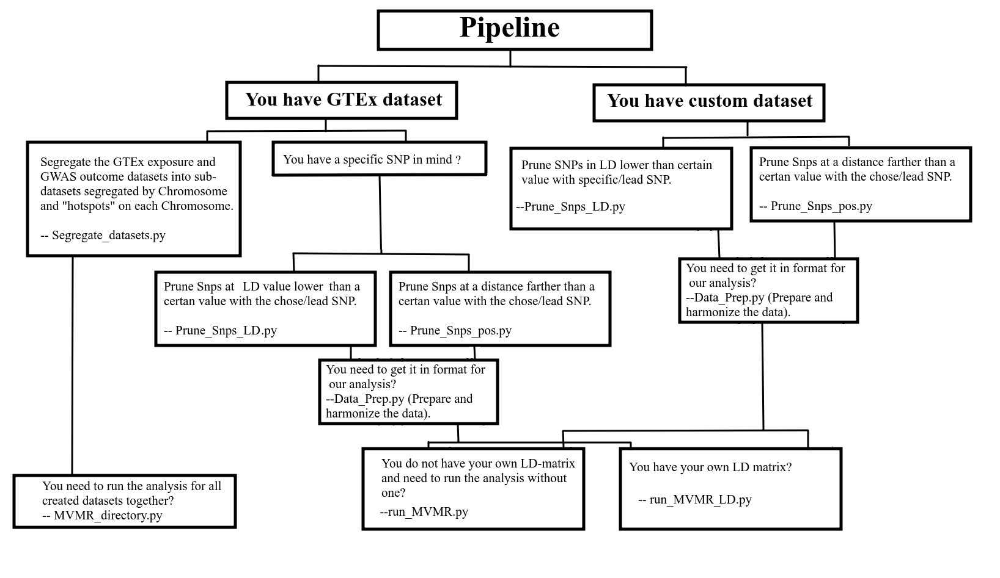
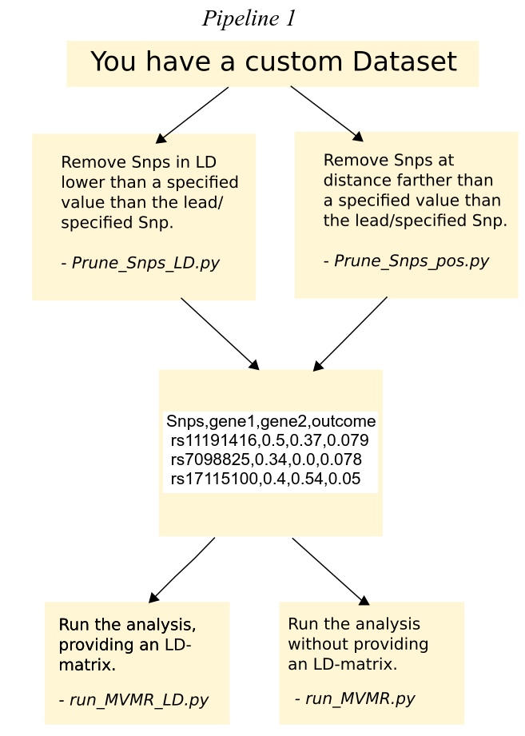
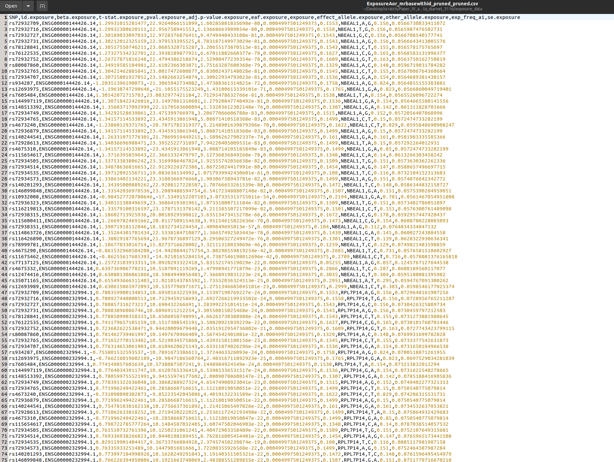
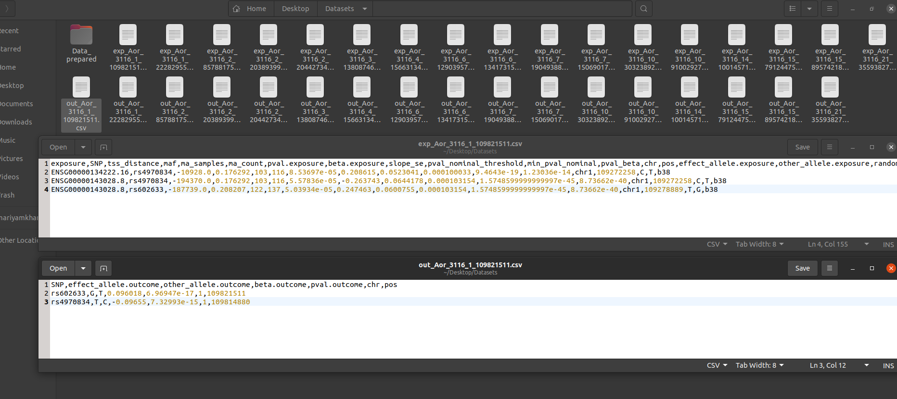

# Causal genes at GWAS loci for Coronary Artery Disease
  Identification of causal genes at GWAS loci with pleiotropic gene regulatory effects using instrumental variable sets.

  
# 1. Guide to software requirements.

To use this code, download the code files and ensure that you have the dependencies explained below. To run the code files, you have to type:

        python3 run_MVMR.py "/home/user/file.csv" "/home/user/ld.csv"

Here, python3 should refer to at least **Python 3.5** and depends on your specific installation of Python.

Before running the code files, check whether you have the following requirements and install them if necessary:

        Python 3.5 or later
        
You can check this by typing ’python’ (or a more specific command as explained above) in the command line. For further support, in particular how to
install python please visit https://www.python.org/.

This Python version has the packages numpy (version 1.11.0 or later), scipy, pandas, sys and rpy2 (version 2.9.4 or later).You can check this by starting this python version (check it especially carefully if you have multiple Python versions on your system) and typing

        import numpy
        import pandas
        import rpy2
        import sys
        import scipy

You would also need statistical programming language **R 3.2.0** or later. You can check this by typing ’R’ in the command line. To install R, please visit
https://www.r-project.org/. If you need to use GWAS summary data for your exposure data (gene expression data) or if you need to get the LD-matix of *Snps* in your data, you can use the package TwoSampleMR (https://mrcieu.github.io/TwoSampleMR/). It uses the IEU GWAS database to obtain data automatically, and you can install and call them in R using the following commands

        install.packages("devtools")
        remotes::install_github("MRCIEU/TwoSampleMR")
        remotes::install_github("MRCIEU/MRInstruments")
and

        library(devtools)
        library(TwoSampleMR)
        library(MRInstruments)

In a situation where some packages are not compatible, you can make sure to have exactly these versions installed:

        pandas 1.5.3
        rpy2 3.5.13
        numpy 1.21
        R  version: 4.3.1

        
# 2. Guide to data requirements.

To estimate the causal effect, the minimum information required is as follows:

- A. *Snps* to exposure effect (exposure can be *expression of a gene*).

- B. *Snps* to outcome effect (outcome can be a disease like *Coronary Artery Disease*).

For the causal analysis, A. and B.  need to be in one file as described in **Section 5.1**

- C. Lastly, optional is LD-matrix of the *Snps* (*Snps* in the *Snps*-exposure/outcome data). This is optional because, *MVMR\_withoutLD.py* has in-built functionality to run the analysis *without the user providing this LD-matrix* **(Section 5.1)**. This is not optional, in the case you want to use *run\_MVMR.py* as this function allows the user to *specify their own LD-matrix* for their data **(Section 5.2)**.

# 3. Steps to running the code.

  

**Case 1:** If you already have the data in the format containing the *Snps* to exposure effects and *Snps* to outcome effects **(Section 5)**. 

   - **Case 1.1 :** If you do not provide an LD-matrix.
   
     - **Step 1 (Section 5.1) :** `run_MVMR.py` 
   
   
   - **Case 1.2 :** If you wish to provide your own LD-matrix.
   
     - **Step 1 (Section 5.2)** : `run_MVMR_LD.py`, LD-matrix can be generated in R as described in **Section 5.2.1**
     
   
 
*In Case 1, the analysis is finished after these steps and you will be returned the *.csv* files of estimates of the causal parameters by different methods and their standard errors.*

     
**Case 2:** If you have the dataset from GTEx and wish to prepare the datasets to run the analysis. 

  - **Step 1 (Section 4.1) :** Download exposure data from GTEx https://gtexportal.org/home/datasets
  
  - **Step 2 (Section 4.2) :** Align the *Snp* id's in the GTEx data with corresponding rs id's `Match_rs_id.py`.

  - **Step 2 (Section 4.3) :** Make sure the GTEx data is in the format required by the TwoSampleMR package.

  - **Step 3 (Section 4.4) :** Extract outcome data using TwoSampleMR package. 

  - **Step 4 (Section 4.5) :** From the exposure and outcome, get data on a specific chromosome and within *chosen* distance and LD-range. You can                                        either 

    - **Step 4.1 (Section 4.5.1) :**   Choose your *Snp* and get exposure and outcome data within *chosen* distance using `Prune_Snps_pos.py`.
    - **Step 4.2 (Section 4.5.2) :**   Choose your *Snp* and get exposure and outcome data within *chosen* LD-range using `Prune_Snps_LD.py`.
    - **Step 4.3 (Section 4.5.3) :**   Harmonize the data and save it in the format required for causal analysis `Data_Prep.py`.
    
    You can run both Step 4.1 and Step 4.2 in any order to get *Snps* within *chosen* distance and *chosen* LD-range.

    Alternate
    
- **Step 4  (Section 4.5.4) :**   For entire exposure/outcome data, get datasets of each chromosome and *Snps* within *chosen* distance and SNPs                                              within        *chosen* LD-range using `Segregate_datasets.py`.

- **Step 5 (Section 5) :** Run the causal analysis, as in Case 1.
  
  Alternate
   
- **Step 5  (Section 5.2) :** In case you want to run the causal analysis for all datasets in a directory (as generated by Step 4.3) simultaneously,                                      you can use `MVMR_directory.py`

# 4. Data and Preparation

We have used this method to estimate the causal effect of *genes* which are shared on a locus on outcome *Coronary Artery Disease* using summary statistics from *genome wide association studies (GWAS)*. We used two different studies for GWAS summary data, firstly, *ebi-a-GCST003116* with trait as coronary artery
disease, from the year 2015 and secondly, *finn-b-I9\_CHD* with trait as Major coronary heart disease event, from the year 2021.

## 4.1 Download exposure data from GTEx

For the summary data on eQTL analysis, we have used STARNET for association analysis from instruments (*Snps*) to exposures (*genes*). But since this
data is not publicly available, exposure data fom GTEx can be download from https://gtexportal.org/home/datasets. Here in the Single-Tissue cis-QTL
data, you can download the full summary statistics of the cis-eQTLs mapped in European-American subjects. You can check the alignment of the effect allele
from https://www.gtexportal.org/home/faq#interpretEffectSize.

When you download data from Gtex, you would have data in the format
such as:

        variant_id            gene_id         maf   slope slope_se pval_beta
        chr1_64764_C_T_b38 ENSG00000227232.5 0.06    0.5    0.1     1.3e-05
        
## 4.2 Align the *Snp*-ID in the GTEx data with corresponding rs-ID.

Since the data you downloaded is not in format to extract GWAS summary data using TwoSampleMR package, you need to get it in their format (**Section 4.3**) and you need to align the variant_id with rs-ID using the GRCh37 build. You can either do this using the function below

        python3 Match_rs_id.py "/home/user/Exposure.csv" "/home/user/annotation.csv" 

Here, *Exposure.csv* is the exposure/gene expression data for a specific tissue from GTEx and *annotation.csv* is the rs-ID annotation file on GTEx. You will be returned *.csv* file with the annotated rs-ID’s in the same directory as your *Exposure.csv* file.

You can now structure this data in format of TwoSampleMR as given in **Section 4.3**. To save the effort of going from GTEx exposure data to data usable in the MRBase package, we have GTEx exposure data aligned with corresponding rs-ID’s and structured in the MRBase format, available at https://drive.google.com/drive/folders/14u2dN8k3OwnZZkSkAQFN0ndboTFJFH-J?usp=share_link.

## 4.3 Make sure the GTEx data is in the format required by the MR-Base package

If you have downloaded the processed GTEx dataset from the linked drive, you need not follow the instructions in this section. If not,

To extract outcome data for the study of interest, we used the **TwoSampleMR Package** (package for performing Mendelian randomization using GWAS
summary data, https://mrcieu.github.io/TwoSampleMR/). Note that if you are using GTEx for exposure datasets, you have to make sure that this minimum information is provided for the extraction of the GWAS summary data from the MRBase package:

        SNP - rs ID.
        beta - The effect size (binary traits log(OR)).
        se - The standard error of the effect size.
        effect_allele - allele of SNP which has the effect marked in beta.

To get the GWAS summary data for this exposure data, you would firstly need to replace the following from the GTEx dataset to the format required by MRBase:

- variant id’s to rs ID’s from the gtex annotation file.

- slope to beta.exposure

- slope se to se.exposure

- pval beta to pval.exposure

- gene id to exposure

Apart from this:

- Create a seperate column for effect allele.exposure using the allele in the GTEx dataset (the effect allele.exposure for the variant chr1\_64764\_C\_T\_b38 is C). 

The corresponding GTEx file for extraction of GWAS summary data from the MRBase package, should look like 

        SNP          exposure          maf   beta.exposure se.exposure pval.exposure effect_allele.exposure other_allele.exposure
        rs769952832 ENSG00000227232.5  0.06  0.5            0.1          1.3e-05          C                     T

## 4.4 Extract outcome data using MR-Base package 

Now if you have the exposure data in the correct format, you can get the GWAS summary data as follows:

The `available_outcomes` function returns a table of all the available studies in the database. Each study has a unique ID.

        library(TwoSampleMR)
        available_outcomes <- available_outcomes()
        View(available_outcomes)
        
        
After this you can extract the outcome data for any study using this code that specifies these steps in R:

        id_outcome <- ebi-a-GCST005195
        outcome_dat <- extract_outcome_data(exposure_data$SNP, id_outcome)
        write.csv(cad_out_dat, "Outcome.csv" ,row.names = FALSE)
        write.csv(exposure_data, "Exposure.csv" ,row.names = FALSE)
        

## 4.5 From the GTEx data, get the data on a specific chromosome and within *chosen* distance and *chosen* LD-range.

Now that you have the outcome and exposure data, you can choose a chromosome and genetic variants within *chosen* distance of each other and within *chosen* Ld-range, to run the causal analysis. Please note that this outcome data is not harmonized with the effect allele of the exposure data.

We will come to data harmonization shortly in **Section 4.5.3** but before make sure that for the causal analysis you follow one or more of the following sub-sections.

   
  
### 4.5.1  Choose your *Snp* and get exposure and outcome data within *chosen* distance.

To make sure that you have data from the same locus and of *snps* within *chosen* distance (ex. 1Mb) of each other, you can choose a *snp* and run the function `Prune_Snps_pos.py`. Once you run this, you will get SNPs (that pass a certain p-value threshold, ex. 5E-8) on the chromosome (integer given as argument for chromosome number) within *chosen* distance around the position of the *snp* (specified by the argument for position of this *snp*), saved in exposure and outcome data *.csv* files.  These files will be saved in the same directory as the original files with the suffix of the chromosome and position appended to them.

Please give as input:

Compulsory:

- Exposure Dataset/Path to exposure dataset.

- Outcome Dataset/Path to outcome dataset.

- chromosome on which your chosen *snp* lies.

Additionally,

- Position (int, ex 137997742) on which your chosen *snp* lies. (Default: Position of lead *snp*)

- Distance (int, example 500000 for 0.5 Mb radius), SNPs within this distance around the chosen/lead SNP will be included for a given dataset. 
  default: 500000

- P-value threshold (float, example 5E-8), SNPs with p-value lower than this (in the GWAS data), will not be included.
  default: 5E-8
 

As an example, if you run

        python3 Prune_Snps_pos.py "/home/user/Exposure.csv" "/home/user/Outcome.csv"  2 203893999 500000 5E-8
        
        
Here the  *snp* has position 203893999 on Chromosome 2 and you wish to have *snps* around this *snp* within 0.5Mb of distance. You will then get
the same Exposure\_2\_203893999.csv and Outcome\_3\_203893999.csv files with SNPs which are significant (p − value ≤ 5E-08) and 0.5Mb around 203893999 on
chromosome 2. Please make sure you give the p-value in the format ()E-(), distance as int (500000, not 500000.0) abd position as int (203893999, not 203893999.0).

Notice, you can give, position of the chosen *snp* (if you do not give this, by default, the position of the lead *snp* is chosen. Hence this function can also be used if you do not have a specific *snp* in mind and just need to prune your data on a chromosome and *hotspot* by distance), distance (radius) and pvalue threshold as the last three arguments.

### 4.5.2  Choose your *Snp* and get exposure and outcome data within *chosen* LD-range.

To make sure that you have data from the same locus and have *snps* abouve *chosen* LD-threshold (ex. 0.01) excluded, you can choose a *snp* and run the function `Prune_Snps_LD.py`. Once you run this, you will get *snps* (that pass a certain p-value threshold, ex. 5E-8) on the chromosome (integer given as argument for chromosome number) within *chosen* distance around the position of the *snp* (specified by the argument for position of this *snp*), saved in exposure and outcome data *.csv* files.  These files will be saved in the same directory as the original files with the suffix of the chromosome and position appended to them.

Please give as input:

Compulsory:

- Exposure Dataset/Path to exposure dataset.

- Outcome Dataset/Path to outcome dataset.

- chromosome on which your chosen *snp* lies.

Additionally,

- Position (int, ex 137997742) on which your chosen *snp* lies. (Default: Position of lead *snp*)

- Lower LD threshold (float, example 0.01), SNPs with LD less than or equal to 0.01 with lead SNP will not be included. 
  default: 0.01

- P-value threshold (float, example 5E-8), SNPs with p-value lower than this (in the GWAS data), will not be included.
  default: 5E-8

As an example, if you run

        python3 Prune_Snps_LD.py "/home/user/Exposure.csv" "/home/user/Outcome.csv" 2 203893999 0.01 5E-8
        
        
Here the  *snp* has position 203893999 on Chromosome 2 and you wish to have *snps* around this *snp* within LD greather than or equal 0.01. You will then getthe same Exposure\_2\_203893999.csv and Outcome\_2\_203893999.csv files with SNPs which are significant (p − value ≤ 5E-08) and within LD >= 0.01 around 203893999 on chromosome 2. Please make sure you give the p-value in the format ()E-(), LD as sloat (1.0, not 1) abd position as int (203893999, not 203893999.0).

Notice, you can give, position of the chosen *snp* (if you do not give this, by default, the position of the lead *snp* is chosen. Hence this function can also be used if you do not have a specific *snp* in mind and just need to prune your data on a chromosome and *hotspot* by LD), LD threshold and pvalue threshold as the last three arguments.

### 4.5.3 Harmonize the data and save it in the format required for causal analysis. 

Lastly to harmonize the exposure and outcome data files as well as having them in format ready for causal analysis. you can give the outputs of either of
the last two functions and use the file `Data Prep.py` to get the datasets in the format needed for running the causal analysis. The input would be
exposure and outcome files you get after you run Seperate chr.py, with comma as a separator and the output would be a file with the format required for the
causal analysis saved in the same input directory with suffix prepared.csv.

          python3 Data_Prep.py "/home/user/Exposure.csv" "/home/user/Outcome.csv"

          

### 4.5.4  For entire exposure/outcome data, get datasets of each chromosome and SNPs within *chosen* distance and *chosen* LD-range.

  

If there is no specific locus where you wish to perform the analysis but rather the entire exposure and outcome data, we have a code `Segregate_datasets.py` which can output the exposure and outcome data segregated per chromosome and "hotspots" per chromosome.

A *hotspot* is characterized by the lead SNP (the SNP which is the most GWAS significant) and SNPs around it which are either a. certain *distance* around the lead SNP (example 0.5 Mb) or b. are in a minimum amount of LD with the lead SNP *(lower LD threshold)* and  are in a maximum amount of LD with the lead SNP *(upper LD threshold)*

Please give as input:

- Exposure Dataset/Path to exposure dataset.

- Outcome Dataset/Path to outcome dataset

- Distance (int, example 500000 for 0.5 Mb radius), SNPs within this distance around the lead SNP will be chosen for a given dataset. 
  default: 500000

- Lower LD threshold (float, example 0.01), SNPs with LD less than or equal to 0.01 with lead SNP will not be included. 
  default: 0.01

- P-value threshold (float, example 5E-8), SNPs with p-value lower than this (in the GWAS data), will not be included.
  default: 5E-8

For the following code

        python3 Segregate_datsets.py "/home/user/Exposure.csv" "/home/user/Outcome.csv" 500000 0.01 1.0

You will have multiple files saved in your initial directory, for each chromosome and for different *hotspots*. To use this function, make sure your output and exposure data are in the format you need for the MRBase package. If you do not provide any distance, the default distance is taken to be 500000, while the default lower LD threshold is 0.0 and upper LD threshold is 1.0.

In the following images, you see the data saved in directories Datasets and Data\_prepared, for the exposure data from GTEx, tissue Aor short for Aorta, GWAS summary study 3116, sort for *ebi-a-GCST003116*, on Chromosome 1 and and *hotspot* around the lead GWAS *Snp* at position 109821511.

# 5. Scripts for causal analysis

There are two major files for running the causal analysis.

## 5.1  If you do not provide an LD-matrix.

          python3 run_MVMR.py "/home/user/file.csv"
          
After python3, the argument should be the file.csv file containing the SNPs to exposure effects and SNPs to outcome effects. The first column is
always the SNP ID’s, the last column is always the SNPs to outcome effect. Every other column in between is treated as an exposure variable. The separator to be used is comma. As an example:

        SNPs,gene1,gene2,outcome
        rs11191416,0.5,0.37,0.079
        rs7098825,0.34,0.0,0.078
        rs17115100,0.4,0.54,0.05

## 5.2  If you provide an LD-matrix.

        python3 run_MVMR_LD.py "/home/user/file.csv" "/home/user/ld.csv"

After python3, the first argument should be the file.csv file containing the SNPs to exposure effects and SNPs to outcome effects. The first column is
always the SNP ID’s (the ID is irrelevant if you are providing the LD-matrix but should still be filled with default values), the last column is always the SNPs to outcome effect. Every other column in between is treated as an exposure variable. The separator to be used is comma. As an example:

        SNPs,gene1,gene2,outcome
        rs11191416,0.5,0.37,0.079
        rs7098825,0.34,0.0,0.078
        rs17115100,0.4,0.54,0.05

The second argument is ld.csv file for the LD matrix. Please make sure the ordering of the SNPs is same as in the exposure file.csv file. This has the format:

        1.0,0.9,0.8
        0.9,1.0,0.7
        0.8,0.7,1.0

The delimiter is comma. The results are saved as .csv file in the same directory as the one given for the exposure file.csv file. The code automatically
prunes for SNPs in perfect-LD and keeps only the first occurring SNPs. If you would like to keep the most significant SNPs amongst perfect LD SNPs then
please order the SNPs in decreasing order of significance in both .csv files.

### 5.2.1  If you provide an LD-matrix. 

The LD-matrix can be generated using the **TwoSampleMR function** `ld_matrix`. Please make sure all *Snps* belong
to the LD panel. To get the LD-matrix, run the following commands in R

      snps <- list(’rs7776079’,’rs36049381’,’rs9349379’)
      matrix <- ld_matrix(snps, with_alleles = FALSE, pop = "EUR")

In snps, add the *SNps* you wish to get the LD-matrix for.

The following code will save the LD-matrix in the format required for our analysis

        write.table(matrix,file= "ld.csv",sep=" ",quote=F,col.names=F,row.names=F)

## 5.3  If you want to run the causal analysis for all datasets in a given directory.

In this case you do not need to provide the LD-matrix and run the causal analysis by the foloowing code:

        python3 MVMR_directory.py "/home/Data_prepared/"
    
Here Data\_prepared is the directory containing multiple datasets in the format as given in **Section 5.1**
        
        
        
# 6. Error messages

You can get the following errors while using the code:

        Error Message : You require at least as many instruments as exposures to run this analysis.

In this case you cannot run the analysis. The code prunes for SNPs in perfect LD so it may happen that you have more *Snps* in the dataset
you provided but they end up getting removed in the pruning and you get this error.

        R[write to console]: The following variants are not present in the LD reference panel rs28789513. 

In this case you should remove the mentioned SNPs (rs28789513) from the dataset. You can only get this error if you do not provide
an LD-matrix and it is generated using the R-package TwoSampleMR.

        rpy2.rinterface_lib.embedded.RRuntimeError: Error in matrix(as.numeric(res), nrow(res), ncol(res)) : 
        non-numeric matrix extent

This is a random error with the ld matrix function and re-running ususally resolves it.

Packages errors: In a situation where some packages are not compatible, you can make sure to have exactly these versions installed:

        pandas 1.5.3
        rpy2 3.5.13
        numpy 1.21
        R  version: 4.3.1

# 7. Comparison to other methods

You can compare your results to other methods in the MVMR community like TWMR https://www.nature.com/articles/s41467-019-10936-0, MVMR
https://onlinelibrary.wiley.com/doi/10.1002/gepi.21758, and functions in the MR-Base package https://mrcieu.github.io/TwoSampleMR/.
For our simulations, we used TWMR as from their github page (code found under https://github.com/eleporcu/TWMR), MRBase with the exposure/
outcome data and analysis after harmonization as metioned in https://mrcieu.github.io/TwoSampleMR/articles/perform_mr.html#multivariable-mr.
As for MVMR, we supplied data as mentioned in their vignette and then ran the analysis https://cran.r-project.org/web/packages/MendelianRandomization/vignettes/Vignette_MR.pdf.

# 8. FAQ's

1. Why are the estimates for the causal parameter different using Least-squares and GMM?
 - This can be the case if the determinant of the covaraince matrix of the instruments is very small. In these cases,, from our simulations, Least-squares 
   estimates tend to be more relaible. If you want, you can also prune for *Snps*  which are in very high LD. You can set a threshold for the maximum LD      theshold such that, out of the *Snps* in LD higher than a certain value (example 0.95), only the *Snp* with the lowest GWAS significance will be kept      and others will be removed from the analysis. By doing this, the determinant of LD-matrix will not be as small (ideally not smaller than 0.01) and the      GMM estimator will inch closer to the Least-squares estimate.
